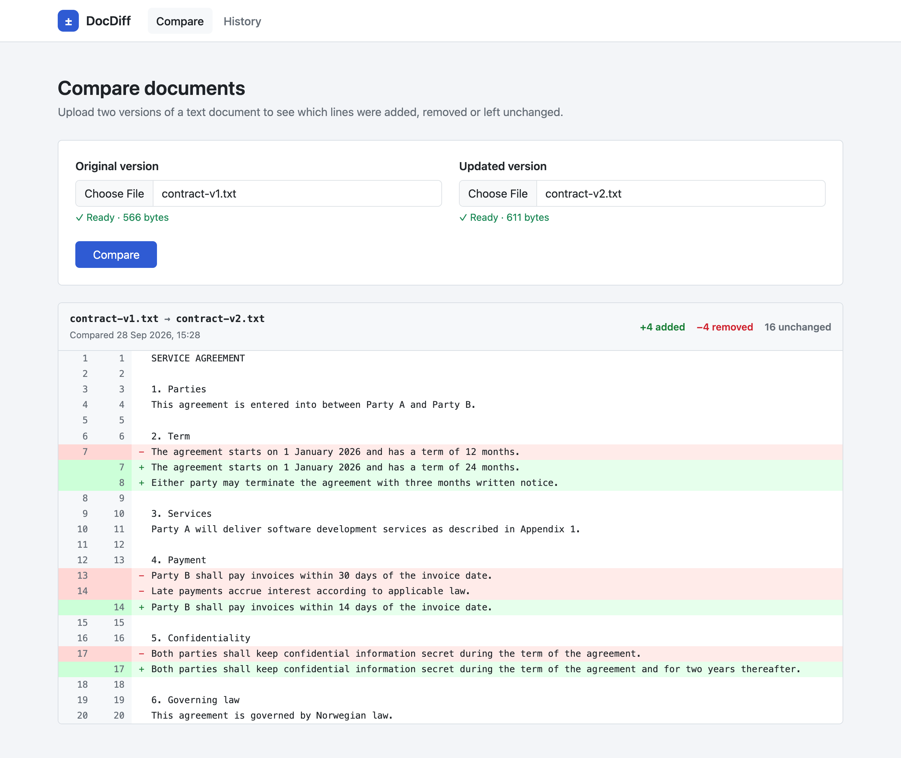
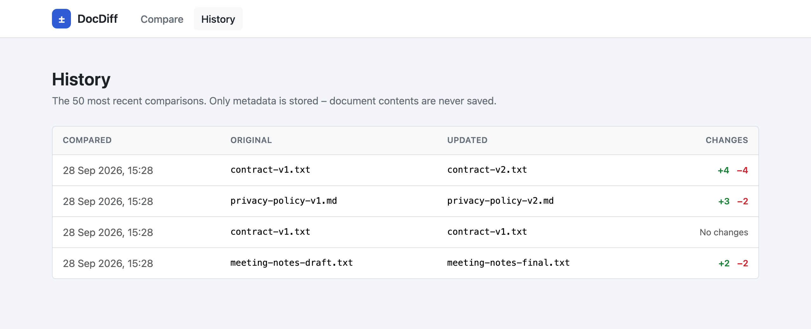
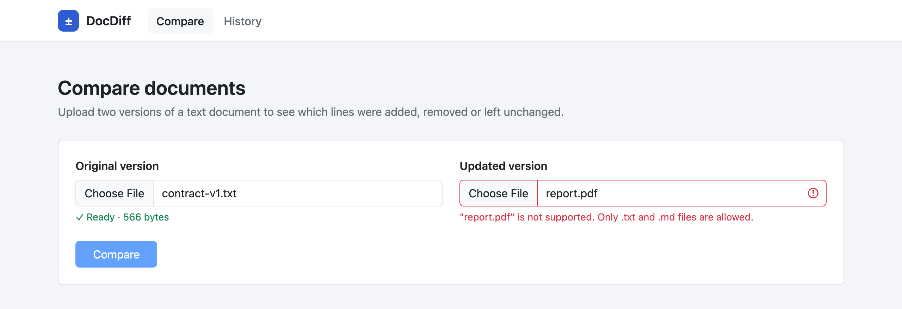

# DocDiff

[](https://github.com/May-ag0/DocDiff/actions/workflows/ci.yml)

DocDiff is a small web application for comparing two versions of a text document. Upload an original and an updated `.txt` or `.md` file to see line by line what was added, removed and left unchanged. Every comparison is logged to a history page.



## Why I built it

I wanted to strengthen my practical .NET/C# experience by building a small full-stack application where application logic, persistence, testing and continuous integration work together.

Comparing document versions is a common task wherever people work with contracts, policies and other text-heavy documents, which makes it a useful and well-defined problem. DocDiff is a technical project and does not provide any legal functionality.

## Features

- Upload two `.txt` or `.md` files, up to 1 MB each
- Line-by-line comparison based on the Longest Common Subsequence (LCS) algorithm
- Diff view with added, removed and unchanged lines, line numbers for both versions and a change summary
- Validation of file type, file size, binary content and line count, with clear error messages
- Comparison history stored in SQLite. Only metadata is stored, never the document contents
- Correct handling of Windows (`\r\n`) and Unix (`\n`) line endings

| History                                       | Validation                                                                   |
| --------------------------------------------- | ---------------------------------------------------------------------------- |
|  |  |

## Tech stack

| Area          | Technology                                        |
| ------------- | ------------------------------------------------- |
| Language      | C# 14 / .NET 10                                   |
| Web framework | ASP.NET Core, Blazor Web App (Interactive Server) |
| Data access   | Entity Framework Core 10                          |
| Database      | SQLite                                            |
| Testing       | xUnit                                             |
| UI            | Bootstrap 5 with custom CSS                       |
| CI            | GitHub Actions                                    |

## Architecture

The solution has two projects: the web application and its tests. Code is organised in folders rather than separate class libraries, which keeps the structure simple for an application of this size.

```
DocDiff/
├── src/DocDiff.Web/
│   ├── Components/
│   │   ├── Layout/               # MainLayout, NavMenu
│   │   ├── Pages/                # Home (compare), History
│   │   ├── DiffView.razor        # Renders the diff
│   │   └── DocumentPicker.razor  # File selection, reading and validation
│   ├── Models/                   # DiffLine, DiffLineType, ComparisonResult, DocumentComparison
│   ├── Services/                 # Comparison, validation and history
│   ├── Data/                     # AppDbContext and EF Core migrations
│   └── Program.cs                # Dependency injection and app setup
├── tests/DocDiff.Tests/          # xUnit tests
└── samples/                      # Example documents
```

### Design decisions

- **No business logic in the UI.** Razor components only handle user interaction. The diff algorithm lives in `DocumentComparisonService`, validation in `UploadValidator` and data access in `ComparisonHistoryService`, so all logic can be tested without the UI.
- **Dependency injection.** Components depend on interfaces (`IDocumentComparisonService`, `IComparisonHistoryService`) rather than concrete classes.
- **`IDbContextFactory` for Blazor Server.** A DI scope in Blazor Server lives as long as the user's connection, which is too long for a `DbContext`. The history service therefore creates a short-lived context for each operation.
- **No repository layer.** EF Core's `DbContext` already acts as a repository and unit of work, so a thin service with the two queries the app needs is enough.
- **UTC timestamps.** SQLite has no date type, so a value converter marks timestamps as UTC when they are read back.

### How the diff works

`DocumentComparisonService` splits both documents into lines and builds an LCS table with dynamic programming, where `table[i, j]` is the length of the longest common subsequence of the remaining lines from position `i` in the original and `j` in the updated document. It then walks through both documents. Equal lines become **Unchanged**. Otherwise the table decides whether skipping the original line (**Removed**) or the updated line (**Added**) preserves the longest common subsequence.

Comparing line 1 with line 1, line 2 with line 2 and so on would mark every line after an insertion as changed. LCS avoids this. The table uses O(n × m) memory, so documents are limited to 5,000 lines.

## Running locally

Requires the [.NET 10 SDK](https://dotnet.microsoft.com/download/dotnet/10.0).

```bash
git clone https://github.com/May-ag0/DocDiff.git
cd DocDiff
dotnet run --project src/DocDiff.Web
```

Open the URL shown in the terminal. The SQLite database is created automatically on first startup. To try the app, compare `samples/contract-v1.txt` with `samples/contract-v2.txt`.

## Testing

```bash
dotnet test
```

| Test class                       | What it covers                                                                                                 |
| -------------------------------- | -------------------------------------------------------------------------------------------------------------- |
| `DocumentComparisonServiceTests` | Identical documents, added, removed and changed lines, empty documents, line-ending differences, change counts |
| `UploadValidatorTests`           | File types, size limit boundaries, binary content, line limit                                                  |
| `ComparisonHistoryServiceTests`  | Ordering, result limits and UTC handling, tested against an in-memory SQLite database                          |

The history tests use a real SQLite database instead of mocks, so the migrations and queries are tested as well.

## Continuous integration

A [GitHub Actions workflow](.github/workflows/ci.yml) restores, builds and runs all tests on every push to `main` and on every pull request.

## Possible future improvements

- Word-level highlighting within changed lines
- Side-by-side view as an alternative to the unified diff
- A more memory-efficient diff algorithm (such as Myers' algorithm) for larger documents
- Optional storage of document contents, so past comparisons can be reopened
- PDF and Word support by extracting text before comparing
- AI-generated summary of the changes
